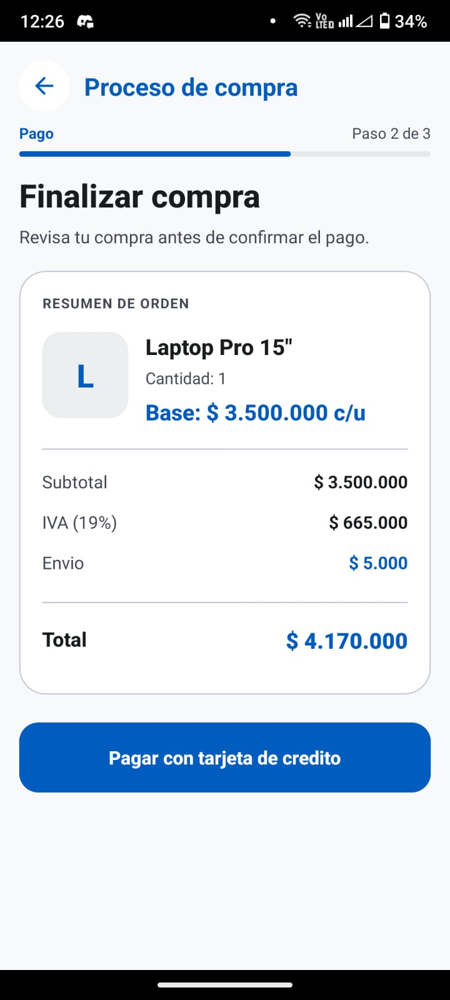
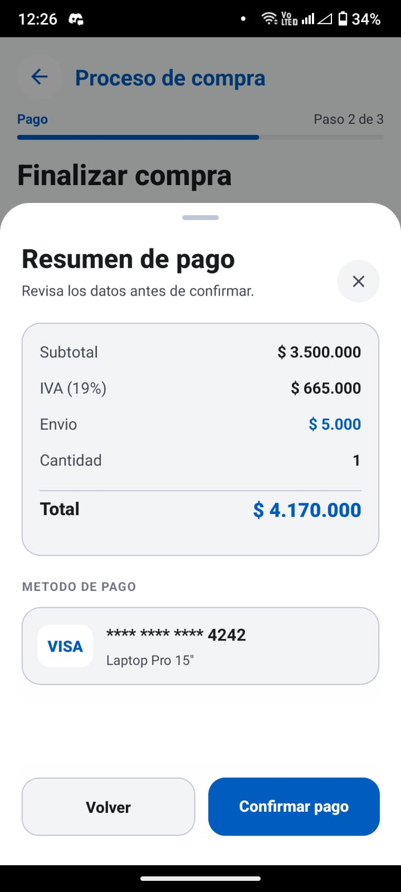
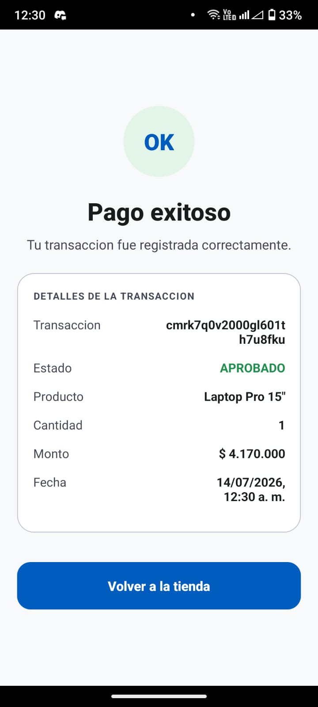

# Credit Card Payment Checkout Frontend

Aplicacion movil en React Native para un flujo de compra con tarjeta de credito. La app permite explorar productos, seleccionar cantidades, completar el checkout, tokenizar la tarjeta en el dispositivo, confirmar el pago y mostrar el resultado final de la transaccion.

## Resumen

- React Native `0.76.9`
- Redux Toolkit para manejo de estado
- React Navigation para flujo multi pantalla
- Jest + Testing Library para pruebas unitarias
- UI en espanol
- Integracion con backend y pasarela sandbox por variables de entorno

## Flujo funcional

La app implementa el proceso solicitado de 7 pasos:

1. `Splash Screen`
2. `Home de productos`
3. `Seleccion de producto`
4. `Checkout`
5. `Backdrop de tarjeta de credito`
6. `Resumen de pago`
7. `Resultado final de la transaccion`

Incluye:

- multiples productos y seleccion de cantidades
- validacion de tarjeta y deteccion visual de VISA / MasterCard
- flujo feliz y flujo de rechazo
- polling para transacciones `PENDING`
- refresco del catalogo luego de compra exitosa
- manejo visible de errores con toast / alertas

## Stack

- React Native
- TypeScript
- Redux Toolkit + React Redux
- React Navigation
- Axios
- `react-native-vector-icons`
- Jest
- `@testing-library/react-native`

## Requisitos

- Node.js `20+`
- npm `10+`
- Android Studio / Android SDK
- JDK compatible con React Native `0.76.x`
- Backend disponible local o remoto

## Variables de entorno

Crea el archivo `.env` a partir de [`.env.example`](file:///c:/Users/duvan/Documents/Node/credit-card-payment-checkout-front/.env.example).

Variables usadas por la app:

| Variable                      | Descripcion                             |
| ----------------------------- | --------------------------------------- |
| `BACKEND_API_URL`             | URL base del backend                    |
| `PAYMENT_GATEWAY_SANDBOX_URL` | URL sandbox de la pasarela              |
| `PAYMENT_GATEWAY_PUBLIC_KEY`  | llave publica sandbox para tokenizacion |

Ejemplo:

```env
BACKEND_API_URL=http://payment.ondeploy.online/
PAYMENT_GATEWAY_SANDBOX_URL=https://api-sandbox.co.uat.wompi.dev/v1
PAYMENT_GATEWAY_PUBLIC_KEY=
```

## Instalacion

```bash
npm install
```

## Como ejecutar la app

### 1. Iniciar Metro

```bash
npm start
```

### 2. Ejecutar en Android

```bash
npm run android
```

## Compilacion Android

### APK debug

```bash
cd android
./gradlew assembleDebug
```

### APK release

```bash
cd android
./gradlew assembleRelease
```

Ruta esperada del APK release:

```text
android/app/build/outputs/apk/release/app-release.apk
```

Ruta local actual:

[app-release.apk](file:///c:/Users/duvan/Documents/Node/credit-card-payment-checkout-front/android/app/build/outputs/apk/release/app-release.apk)

## Pruebas unitarias

Ejecutar todas las pruebas:

```bash
npm test
```

Ejecutar pruebas con cobertura:

```bash
npm test -- --coverage
```

## Resultado actual de pruebas

Suite actual:

- `Test Suites`: `31 passed, 31 total`
- `Tests`: `118 passed, 118 total`
- `Snapshots`: `0 total`

Cobertura actual:

| Metrica      | Resultado |
| ------------ | --------- |
| `Statements` | `99.1%`   |
| `Branches`   | `95.25%`  |
| `Functions`  | `97.56%`  |
| `Lines`      | `99.07%`  |

Estos resultados cumplen y superan el umbral minimo solicitado de `80%`.

## Integracion con backend

La aplicacion consume el backend por medio de `BACKEND_API_URL`.

Backend configurado actualmente para pruebas:

```text
http://payment.ondeploy.online/
```

Endpoints usados por la app:

- `GET /products`
- `GET /products/:id`
- `POST /transactions/initiate`
- `GET /transactions`
- `GET /transactions/:id`

## Estructura principal

```text
src/
├── components/
├── constants/
├── hooks/
├── navigation/
├── screens/
├── services/
├── store/
└── utils/
```

## Decisiones tecnicas

- Redux centraliza carrito, productos, ordenes y transacciones.
- La tokenizacion de tarjeta se realiza desde el cliente y el backend solo recibe `cardToken`.
- La UI esta completamente traducida al espanol.
- Los calculos de precio, IVA y envio se centralizan para mantener consistencia.
- El flujo contempla estados `APPROVED`, `DECLINED`, `VOIDED` y `PENDING`.
- Se agregaron utilidades de cifrado y cobertura alta de pruebas unitarias.

## Evidencia visual

### Pantallas








### Flujo corto


